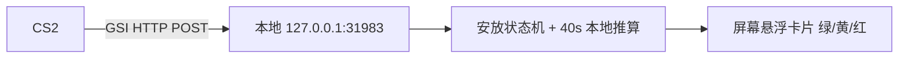

# CS_C4 — CS2 炸弹倒计时悬浮窗

一个纯 Python（标准库，零第三方依赖）的 CS2 炸弹倒计时悬浮窗。CS2 本身不显示炸弹倒计时，本工具通过 Valve 官方 **Game State Integration（GSI）** 接口获知炸弹状态，在炸弹安放后于屏幕显示剩余倒计时，并根据剩余时间提示是否来得及拆弹。

## 显示规则

| 剩余时间 | 卡片颜色 | 提示文字 |
| --- | --- | --- |
| > 10 秒 | 绿色 | Defuse Available |
| 5 ~ 10 秒（含 10） | 黄色 | Defuse Available by Kit |
| < 5 秒 | 红色 | Defuse Unavailable |

- 炸弹拆除或爆炸后，悬浮卡片自动隐藏。
- 悬浮卡片是**深色圆角卡片**（320×110）：大号倒计时数字 + 状态文字 + 彩色描边；**圆角与文字之外的区域为真透明**（per-pixel alpha 合成，不依赖 DWM 色键，不会出现整窗黑块）；置顶显示、鼠标点击穿透，不挡游戏操作；位置固定，修改 `config.py` 中的 `CARD_X`/`CARD_Y` 可调整。
- 倒计时与状态文字颜色随拆弹可行性变化：>10 秒绿色、10~5 秒黄色、<5 秒红色。
- 控制面板标题栏默认隐藏，鼠标悬停到面板上才显示，此时可拖动面板。
- 两个窗口都会周期刷新**最高置顶**层级，游戏使用**窗口化全屏**（无边框）时可稳定显示在游戏之上；若 CS2 使用**独占全屏**模式，部分显卡驱动/系统会让置顶窗口无法显示在游戏之上，此时请改用窗口化全屏，或直接看控制面板上的倒计时数字（安放时面板会同步显示剩余秒数与颜色）。

## 工作原理



- GSI 是 Valve 官方提供的游戏状态推送接口，**不读取内存、不注入游戏进程、零反作弊风险**。
- GSI 只在状态变化时携带炸弹字段，且不提供精确秒数；因此本工具在检测到"已安放"的瞬间开始本地计时，按 40 秒推算剩余时间（误差约 0.3 秒）。**一旦安放完成，即使某次推送不包含炸弹数据，倒计时也会持续进行**（粘性计时）；拆除/爆炸、回合结束，或炸弹字段连续 20 秒未再推送（对局提前结束）时复位隐藏。

## 使用步骤

1. 启动程序（见第 3 步）。**首次启动会强制弹出安装对话框**（未安装 GSI 配置无法使用）：点「自动安装」会自动定位 CS2 的 cfg 文件夹并写入 `gamestate_integration_c4_timer.cfg`；找不到时点「手动选择」指定该文件夹。安装成功后程序才进入正常运行界面，此流程只需一次，安装标记保存在用户目录，之后启动自动跳过。

   也可以手动把 `gamestate_integration_c4_timer.cfg` 复制到：

   ```
   <Steam 安装目录>\steamapps\common\Counter-Strike Global Offensive\game\csgo\cfg\
   ```

2. **先放好 cfg，再启动 CS2**。GSI 配置只在 CS2 进程启动时读取一次；游戏运行中（包括在练习模式内）才放入或修改 cfg 不会生效，必须重启 CS2，或在游戏内控制台执行：

   ```
   exec gamestate_integration_c4_timer
   ```

3. 启动程序：

   ```powershell
   python main.py
   ```

### 练习模式注意

练习模式（Practice）是游戏内的模式切换，**不会**重新加载 GSI 配置。如果在练习模式中测试没有倒计时，优先按上面第 2 步处理：确认 cfg 是在 CS2 启动前放入的，然后重启 CS2 再进练习模式。

## 排查：数据链路是否连通

控制面板的小圆点与状态文字用于定位问题：

- 圆点**灰色**、文字"等待 CS2"：最近 8 秒没收到任何推送 → GSI 配置未加载（按上文时序处理）、CS2 未运行，或刚启动程序还没等到首个心跳（最多 2 秒）。
- 圆点**绿色**、文字"炸弹: carried/planted/…"或"对局中，炸弹未安放"：数据链路正常。安放炸弹时应看到 `炸弹: planted`，并弹出倒计时卡片。
- 文字"回合结束"/"冻结时间"：对局结束或换边，属正常状态；下一局安放 C4 时会自动重新开始倒计时。

另外，程序会把收到的关键字段写入 `gsi_dump.log`（与 main.py 同目录，JSONL 格式、限频），内容包括炸弹状态、回合阶段、直供倒计时，排查时可直接查看或发给我分析。

## 对局提前结束的处理

CS2 的 GSI 是差量推送：炸弹字段只在状态变化时携带，已安放期间约每 6 秒重推一次，不提供精确秒数。因此：

- 安放成功瞬间开始本地 40 秒计时（误差约 0.3 秒），之后即使某次推送缺失炸弹字段也持续倒计时。
- 拆除/爆炸或回合阶段结束（`over`）→ 立即复位隐藏。
- 炸弹状态绑定回合：拆除后 CS2 不再推送炸弹字段，一旦回合阶段离开 `live`（`over`/`freezetime`），上回合的炸弹状态自动作废，控制面板恢复显示"回合结束/冻结时间/对局中"；下一局安放 C4 时重新从 40 秒起算。
- 若对局在爆炸前提前结束（如 CT 全灭获胜、比赛中断）且 CS2 未下发终结信号：炸弹字段连续 20 秒未再推送即视为对局已结束，卡片自动复位隐藏，**不会把残留状态带进下一局**。

## 无游戏预览（演示模式）

不启动 CS2 也能看到完整效果：

```powershell
python main.py --demo
```

演示模式会自动模拟"安放 → 40 秒倒计时 → 拆除/爆炸"的完整流程。

## 自定义

所有可调参数集中在 [config.py](config.py)：端口、计时总秒数、三档阈值与颜色、卡片/面板位置（`CARD_X`/`CARD_Y`）、是否显示小数位。

## 环境要求

- Python 3.10+
- Windows（悬浮窗透明与点击穿透依赖 Win32 API）

## 打包为 exe（可选）

```powershell
pip install pyinstaller
pyinstaller --noconfirm --clean --onefile --windowed --name CS_C4 --add-data "gamestate_integration_c4_timer.cfg;." main.py
```

生成文件在 `dist\CS_C4.exe`（单文件、无控制台窗口、内置 GSI 配置，可直接拷贝到任意目录运行）。已生成过 `CS_C4.spec`，之后重新构建也可直接 `pyinstaller CS_C4.spec`。

首次运行 exe 时同样会弹出强制安装 GSI 配置的对话框；`gsi_dump.log` 会写在 exe 所在目录。